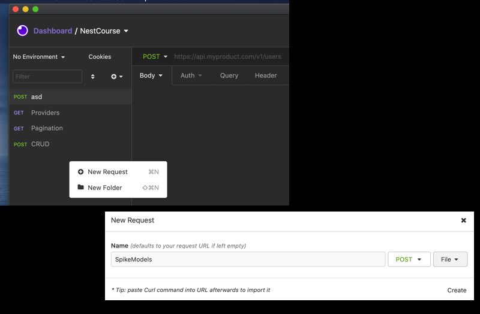

# API modelo de datos Spike
El siguiente repositorio tiene como finalidad exponer una API que pueda utilizarse para la predicción de precios de insumos básicos en Chile.
La API fue construida en base a un archivo JupyterNotebook que implementaba la fase de preprocesamiento de datos, entrenamiento y testeo de modelos.
El repositorio incluye un archivo docker-compose para levantar un ambiente de Airflow, para testear pipeline de entrenamiento y generacion de modelos, 
en el caso que se requiera realizar un reentrenamiento del modelo a futuro con datos actualizados.


## 💻 Pré-requisitos

Antes de começar, verifique se você atendeu aos seguintes requisitos:

* Tener instalado docker en tu computador y ademas docker-composer para cargar el contenedor de pruebas con AIRDFLOW.
* Python3.7 o superior.
* Insomnia/Postman o la extención e Rest API de VisualStudioCode. En este readme lo demostraremos con INSOMNIA, el cual puedes descargar 
[de este link](https://insomnia.rest/download).
* Si usas linux, y cuentas con CURL instalado, tambien pasaremos el comando para realizar test con la api del modelo.


## Creando contenedor para testeo de API.

Primero debemos clonar el repositorio de la API, y dentro del directorio SpikeModels ejecutar:

`docker-compose up -d`

Esto expondra el container llamado "spike_model" en el puerto 5000. Si deseas cambiar el puerto, 
puedes hacerlo redirigiento otro que tengas libre dentro del docker-compose.yml en la sección ports.

Dentro del repositorio existe una carpeta llama data el cual contiene los siguientes archivos:

```
SpikeModels/
 | data/
 |   | banco_central.csv
 |   | precio_leche.csv
 |   | precipitaciones.csv
 |   | x_test.csv
```
los 3 primeros csv son los archivos csv de datos utilizados para preprocesamiento y entrenamiento, el archivo x_test.csv es un archivo 
utilizado como input de testeo, que corresponde al 20% de los datos que no se utilizaron para entrenar, con el fin de que puedas
testear inmediatamente el output de la API enviando ese archivo mediante POST con INSOMNIA ( o Postman si lo prefieres ).

## Para testear API usando INSOMNIA

abrir insomnia y creamos un nuevo request, usando como name SpikeModels, seleccionaremos método POST y seleccionamos FILE 
para poder pasar el archivo CSV de testing y realizar la prueba.



El contenedor esta corriendo una aplicacion en FLASK en el puerto 5000, y el endpoint a utilizar es `http://localhost:5000/spike/model_1/csv`.
Vamos a enviar el archivo de testing x_test.csv que esta en la carpeta data, ahora solo tenemos que seleccionar "Choose File" para buscar este archivo dentro 
de nuestro repositorio:


Luego de essto solo queda presionar SEND, si todo sale bien, y nuestro contenedor esta ejecutandose, deberiamos recibir un response 200 OK:


El json obtenido deberia tener un key llamado predictions con los valores de precio de leche que nuestro modelo predijo desde `x_test.csv`.

## Para testear API usando CURL

Si se esta probando en un ambiente unix, ya sea en ubunto o macos, puedes testear usando curl de la siguiente manera en la terminal de comandos:

```
curl -i -X POST  http://127.0.0.1:3000/spike/model_1/csv  -H "Content-Type: text/csv" --data-binary "@./data/x_test.csv"
```

Solo tener cuidado de que en el parametro --data-binary incluyamos la ruta absoluta a nuestro archivo de testing `x_test.csv`.


# PIPELINE - AIRFLOW

El repositorio incluye in archivo llamado `SpikePipeline.py` el cual es un dag para airflow que tambien puedes probar utilizando docker.
Para esto, puedes entrar a la carpeta `airflow_docker` del repositorio y ejecutar `docker-compose up -d`. Lo cual deberia descargar y configurar 
un ambiente de airflow para testear. Luego de que el contenedor de AIRFLOW este ejecutandose, entrar a `http://127.0.0.1:8080` haciendo login con 
las credenciales "airflow" y password "airflow". 

Dentro de AIRFLOW, buscar el DAG `SpikeModelGenerator` o bien entrar al dag en este [link](http://127.0.0.1:8080/graph?dag_id=SpikeModelGenerator), en el 
podras ver que existen 2 tasks que te permitiran generar los modelos necesarios, si deseas reentrenar los modelos , solo dale play para que la API utilice el nuevo modelo generado:


Si todo sale bien y el proceso termina, airflow deberia crear el archivo model_1 dentro de la carpeta `/pickes/models`. 

PD: El archivo JupyterNotebook provisto para este desafio tenia 2 modelos generados. Si bien el primero da mejores resultados, nuestor pipeline genera 2
archivos pickle dentro de pickles/models, los cuales son model_1 y model_2. Para testear el model_2, simplemente basta con cambiar la URL del método POST
a `http://127.0.0.1:3000/spike/model_2/csv`. En este caso se debe pasar el arhcivo `x_test_noleche.csv`, ya que este modelo 2 no utiliza el precio de la leche anterior, solo el resto de las variables mencionadas en el jupyter notebook del desafio original, puedes encontrar estos archivos para mayor entendimiento 
en la carpeta docs del repositorio.

Muchas gracias por la oportunidad :D, aprendi mucho!

Atte.

David R.


